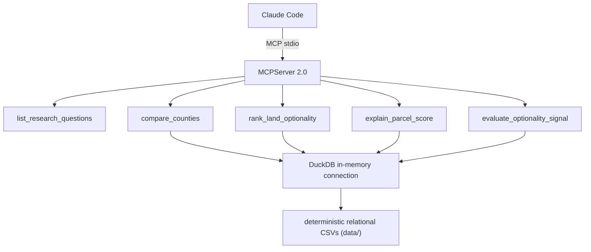
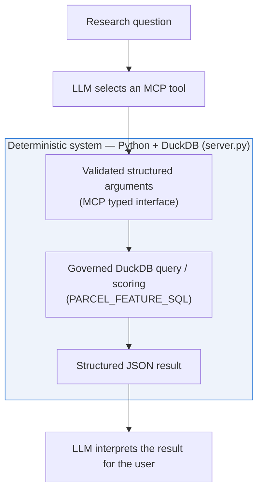

# Architecture

`list_research_questions` is the exception: it returns a static list and never opens a
DuckDB connection.

## Request lifecycle and the deterministic/LLM boundary

Every tool call follows the same path, and the deterministic half (shaded) is where
`server.py`, not the LLM, owns the answer:

See [`docs/CODE_WALKTHROUGH.md`](CODE_WALKTHROUGH.md) for exactly where this boundary
sits in code, table-by-table, and for the visualizations (score distribution, county
comparison, score anatomy, decile validation) generated from the checked-in synthetic
data.

## Runtime boundary

The MCP process performs **no dataset generation, no package installation, and no persistent DuckDB rebuild** during startup.

Each analytical tool opens a short-lived in-memory DuckDB connection over explicit absolute file paths. This keeps MCP startup small and predictable.

## Reasoning vs computation

Claude handles:
- user intent;
- question generation;
- tool selection;
- synthesis;
- explanation.

The MCP/DuckDB layer handles:
- joins;
- governed definitions;
- score computation;
- aggregations;
- evaluation.

This separation prevents the LLM from silently redefining research metrics.
